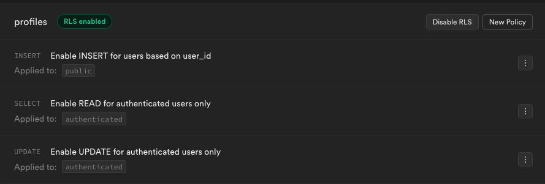

# Week 05 Social Media App

# SCREENSHOTS

## Description

-   Users can create a profile
-   Users are listed on the main page
-   Can click on a user to be taken to their profile page, where they can be upvoted or downvoted

## Project Planning

### Supabase Table

-   profiles
    -   id
    -   user_id (foreign key to user table)
    -   username (could use email instead)
    -   bio
    -   stars (popularity on assignment - for upvotes and downvotes)
    -   avatar_url

### Pages

-   profile list (home page)
-   profile editor/creator
-   profile detail page

### HTML

editor page

-   `form`
    -   input with label for USERNAME
    -   input with label for BIO
    -   input with label for Avatar (type="file")
    -   img (for preview of avatar)
    -   submit button
    -   p tag for error display

profiles list (home page)

-   list container that is hardcoded
    -   render list items

profile detail page

-   hardcode an img and header
-   stars detail container

### Events

editor page

-   on page load, get profile information from Supabase and display on form if it exists
-   avatar img input ("change"), display img preview
-   form submit:
    -   utilize user input and send it to Supabase
    -   upsert (insert and update) to send to Supabase (if it doesn't exist, create it. If it does exist, then edit it)
    -   error handling to display issues to user

profile page

-   up and down vote button clicks
    -   increment or decrement the stars count in Supabase
-   page load fetch

profiles list (home page)

-   page load fetch

### Functions

-   uploadImage(imagePath, imageFile)
-   upsertProfile(profile)
-   getProfile(user_id) and getProfileById(id)
-   incrementStars(id) and decrementStars(id)

### Workflow Slices

1. Create/edit simple profile (username and bio)
2. add in avatar upload to profile
3. get Profile back from Supabase (use it to fill in form)
4. error handling and button disable while uploading image to Supabase
5. Profiles list (home page)
6. Profile detail page and stars up/down votes
